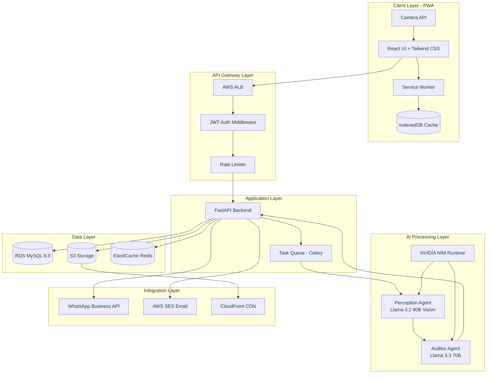
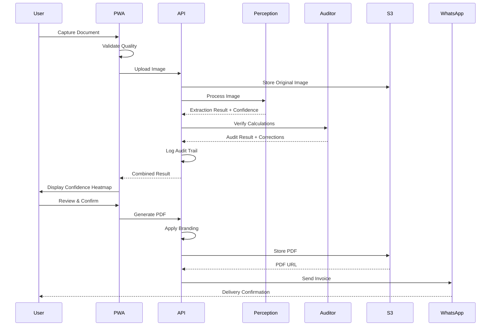

# Design Document: SmartFlow Document Intelligence Platform

## Overview

SmartFlow is an AI-powered document intelligence platform that transforms handwritten business documents into professional, GST-compliant invoices. The system employs a dual-agent AI architecture where a Perception Agent (Llama 3.2 90B Vision-Instruct) extracts data from documents, and an Auditor Agent (Llama 3.3 70B Instruct) verifies calculations and ensures GST compliance. The platform is built as a Progressive Web Application (PWA) with offline-first capabilities, targeting India's 63 million MSMEs.

The design prioritizes:
- **Speed**: 30-45 second end-to-end processing time
- **Accuracy**: >95% extraction accuracy with self-correction
- **Reliability**: Offline-first architecture with automatic sync
- **Trust**: Transparent audit trails showing all AI corrections
- **Accessibility**: WCAG 2.1 Level AA compliance with Hindi/English support

## Architecture

### High-Level System Architecture



### Component Interaction Flow



## Components and Interfaces

### 1. Frontend Components (React + TypeScript)

#### 1.1 Camera Capture Component
**Responsibility**: Handle document capture with quality validation

**Interface**:
```typescript
interface CameraCapture {
  // Capture image from camera or gallery
  captureImage(): Promise<CapturedImage>
  
  // Validate image quality (blur, lighting, angle)
  validateQuality(image: Blob): QualityResult
  
  // Compress image to max 2MB
  compressImage(image: Blob): Promise<Blob>
}

interface CapturedImage {
  blob: Blob
  timestamp: Date
  filename: string
  quality: QualityResult
}

interface QualityResult {
  isValid: boolean
  blurScore: number  // 0-100
  lightingScore: number  // 0-100
  angleScore: number  // 0-100
  suggestions: string[]
}
```

#### 1.2 Offline Queue Manager
**Responsibility**: Manage document queue for offline processing

**Interface**:
```typescript
interface OfflineQueueManager {
  // Add document to offline queue
  enqueue(document: QueuedDocument): Promise<void>
  
  // Get all queued documents
  getQueue(): Promise<QueuedDocument[]>
  
  // Process queue when online
  processQueue(): Promise<ProcessResult[]>
  
  // Check connectivity status
  checkConnectivity(): boolean
  
  // Clear processed documents
  clearProcessed(documentIds: string[]): Promise<void>
}

interface QueuedDocument {
  id: string
  imageBlob: Blob
  metadata: DocumentMetadata
  timestamp: Date
  retryCount: number
}

interface DocumentMetadata {
  userId: string
  captureTimestamp: Date
  deviceInfo: string
}
```

#### 1.3 Confidence Heatmap Component
**Responsibility**: Display extraction results with visual confidence indicators

**Interface**:
```typescript
interface ConfidenceHeatmap {
  // Render field with confidence color
  renderField(field: ExtractedField): JSX.Element
  
  // Handle field edit
  onFieldEdit(fieldName: string, newValue: any): void
  
  // Get confidence color
  getConfidenceColor(score: number): string
}

interface ExtractedField {
  name: string
  value: any
  confidenceScore: number  // 0-100
  isAICorrected: boolean
  originalValue?: any
}
```

#### 1.4 Service Worker
**Responsibility**: Enable offline functionality and caching

**Interface**:
```typescript
interface ServiceWorker {
  // Cache static assets
  cacheAssets(assets: string[]): Promise<void>
  
  // Handle fetch requests with cache-first strategy
  handleFetch(request: Request): Promise<Response>
  
  // Background sync for queued documents
  backgroundSync(): Promise<void>
  
  // Update cache when new version available
  updateCache(): Promise<void>
}
```

### 2. Backend Components (Python + FastAPI)

#### 2.1 Document Processing Service
**Responsibility**: Orchestrate AI processing pipeline

**Interface**:
```python
class DocumentProcessingService:
    def process_document(
        self, 
        image_data: bytes, 
        user_id: str
    ) -> ProcessingResult:
        """
        Process document through Perception and Auditor agents
        
        Args:
            image_data: Raw image bytes
            user_id: User identifier
            
        Returns:
            ProcessingResult with extraction and audit data
        """
        pass
    
    def retry_failed_processing(
        self, 
        document_id: str
    ) -> ProcessingResult:
        """Retry processing for failed documents"""
        pass

@dataclass
class ProcessingResult:
    document_id: str
    extraction_result: ExtractionResult
    audit_result: AuditResult
    processing_time_ms: int
    status: ProcessingStatus
```

#### 2.2 Perception Agent Client
**Responsibility**: Interface with Llama 3.2 90B Vision model via NVIDIA NIM

**Interface**:
```python
class PerceptionAgentClient:
    def extract_invoice_data(
        self, 
        image_data: bytes
    ) -> ExtractionResult:
        """
        Extract structured invoice data from image
        
        Args:
            image_data: Document image bytes
            
        Returns:
            ExtractionResult with all fields and confidence scores
        """
        pass
    
    def _build_prompt(self) -> str:
        """Build vision model prompt for invoice extraction"""
        pass
    
    def _parse_response(
        self, 
        model_output: str
    ) -> ExtractionResult:
        """Parse model JSON output into structured result"""
        pass

@dataclass
class ExtractionResult:
    invoice_number: Optional[str]
    invoice_date: Optional[date]
    party_name: Optional[str]
    party_gstin: Optional[str]
    party_address: Optional[str]
    line_items: List[LineItem]
    subtotal: Optional[Decimal]
    gst_rate: Optional[Decimal]
    gst_amount: Optional[Decimal]
    total_amount: Optional[Decimal]
    confidence_scores: Dict[str, int]  # field_name -> score (0-100)
    raw_response: str

@dataclass
class LineItem:
    description: str
    hsn_code: Optional[str]
    quantity: Decimal
    unit: str
    rate: Decimal
    amount: Decimal
    confidence_score: int
```

#### 2.3 Auditor Agent Client
**Responsibility**: Verify calculations and GST compliance

**Interface**:
```python
class AuditorAgentClient:
    def audit_extraction(
        self, 
        extraction: ExtractionResult
    ) -> AuditResult:
        """
        Verify calculations and GST compliance
        
        Args:
            extraction: Result from Perception Agent
            
        Returns:
            AuditResult with corrections and compliance status
        """
        pass
    
    def _verify_line_items(
        self, 
        items: List[LineItem]
    ) -> List[Correction]:
        """Verify quantity × rate = amount for each line item"""
        pass
    
    def _verify_subtotal(
        self, 
        items: List[LineItem], 
        subtotal: Decimal
    ) -> Optional[Correction]:
        """Verify subtotal equals sum of line items"""
        pass
    
    def _verify_gst_calculation(
        self, 
        subtotal: Decimal, 
        gst_rate: Decimal, 
        gst_amount: Decimal
    ) -> Optional[Correction]:
        """Verify GST amount calculation"""
        pass
    
    def _verify_total(
        self, 
        subtotal: Decimal, 
        gst_amount: Decimal, 
        total: Decimal
    ) -> Optional[Correction]:
        """Verify total = subtotal + GST"""
        pass
    
    def _validate_gstin(
        self, 
        gstin: str
    ) -> GSTINValidation:
        """Validate GSTIN format and checksum"""
        pass

@dataclass
class AuditResult:
    corrections: List[Correction]
    compliance_status: ComplianceStatus
    compliance_issues: List[str]
    audit_time_ms: int

@dataclass
class Correction:
    field_name: str
    original_value: any
    corrected_value: any
    reason: str
    correction_type: CorrectionType  # CALCULATION, FORMAT, COMPLIANCE

@dataclass
class GSTINValidation:
    is_valid: bool
    state_code: Optional[str]
    pan: Optional[str]
    errors: List[str]

class ComplianceStatus(Enum):
    COMPLIANT = "compliant"
    NON_COMPLIANT = "non_compliant"
    NEEDS_REVIEW = "needs_review"

class CorrectionType(Enum):
    CALCULATION = "calculation"
    FORMAT = "format"
    COMPLIANCE = "compliance"
```

#### 2.4 PDF Generation Service
**Responsibility**: Generate branded PDF invoices using WeasyPrint

**Interface**:
```python
class PDFGenerationService:
    def generate_invoice_pdf(
        self, 
        invoice_data: InvoiceData, 
        branding: BrandingConfig
    ) -> PDFResult:
        """
        Generate PDF invoice with branding
        
        Args:
            invoice_data: Finalized invoice data
            branding: User's branding configuration
            
        Returns:
            PDFResult with S3 URL and metadata
        """
        pass
    
    def _render_html_template(
        self, 
        invoice_data: InvoiceData, 
        branding: BrandingConfig
    ) -> str:
        """Render Jinja2 template with invoice data"""
        pass
    
    def _convert_to_pdf(
        self, 
        html: str
    ) -> bytes:
        """Convert HTML to PDF using WeasyPrint"""
        pass
    
    def _upload_to_s3(
        self, 
        pdf_bytes: bytes, 
        filename: str
    ) -> str:
        """Upload PDF to S3 and return CloudFront URL"""
        pass

@dataclass
class InvoiceData:
    document_id: str
    invoice_number: str
    invoice_date: date
    party_name: str
    party_gstin: Optional[str]
    party_address: str
    line_items: List[LineItem]
    subtotal: Decimal
    gst_rate: Decimal
    gst_amount: Decimal
    total_amount: Decimal
    notes: Optional[str]

@dataclass
class BrandingConfig:
    logo_url: Optional[str]
    primary_color: str  # Hex color
    secondary_color: str
    company_name: str
    company_address: str
    company_gstin: str
    company_phone: str
    company_email: str
    template_style: str  # modern, classic, minimal

@dataclass
class PDFResult:
    pdf_url: str
    cloudfront_url: str
    file_size_bytes: int
    generation_time_ms: int
```

#### 2.5 Distribution Service
**Responsibility**: Send invoices via WhatsApp and Email

**Interface**:
```python
class DistributionService:
    def send_via_whatsapp(
        self, 
        recipient_phone: str, 
        pdf_url: str, 
        invoice_data: InvoiceData
    ) -> DeliveryResult:
        """
        Send invoice via WhatsApp Business API
        
        Args:
            recipient_phone: Phone number in +91XXXXXXXXXX format
            pdf_url: CloudFront URL of PDF
            invoice_data: Invoice metadata for preview message
            
        Returns:
            DeliveryResult with status and message ID
        """
        pass
    
    def send_via_email(
        self, 
        recipient_email: str, 
        pdf_url: str, 
        invoice_data: InvoiceData
    ) -> DeliveryResult:
        """Send invoice via AWS SES"""
        pass
    
    def _validate_phone_number(
        self, 
        phone: str
    ) -> bool:
        """Validate Indian phone number format"""
        pass
    
    def _validate_email(
        self, 
        email: str
    ) -> bool:
        """Validate email format"""
        pass
    
    def _retry_with_backoff(
        self, 
        delivery_fn: Callable, 
        max_retries: int = 3
    ) -> DeliveryResult:
        """Retry delivery with exponential backoff"""
        pass

@dataclass
class DeliveryResult:
    success: bool
    message_id: Optional[str]
    delivery_time_ms: int
    error_message: Optional[str]
    retry_count: int
```

### 3. Data Models

#### 3.1 Database Schema (MySQL)

```sql
-- Users table
CREATE TABLE users (
    id VARCHAR(36) PRIMARY KEY,
    email VARCHAR(255) UNIQUE NOT NULL,
    password_hash VARCHAR(255) NOT NULL,
    phone_number VARCHAR(15) NOT NULL,
    business_name VARCHAR(200) NOT NULL,
    created_at TIMESTAMP DEFAULT CURRENT_TIMESTAMP,
    updated_at TIMESTAMP DEFAULT CURRENT_TIMESTAMP ON UPDATE CURRENT_TIMESTAMP,
    is_active BOOLEAN DEFAULT TRUE,
    failed_login_attempts INT DEFAULT 0,
    account_locked_until TIMESTAMP NULL,
    INDEX idx_email (email),
    INDEX idx_phone (phone_number)
) ENGINE=InnoDB DEFAULT CHARSET=utf8mb4 COLLATE=utf8mb4_unicode_ci;

-- Documents table
CREATE TABLE documents (
    id VARCHAR(36) PRIMARY KEY,
    user_id VARCHAR(36) NOT NULL,
    invoice_number VARCHAR(50) NOT NULL,
    invoice_date DATE NOT NULL,
    party_name VARCHAR(200) NOT NULL,
    party_gstin VARCHAR(15),
    party_address TEXT,
    line_items JSON NOT NULL,
    subtotal DECIMAL(15, 2) NOT NULL,
    gst_rate DECIMAL(5, 2) NOT NULL,
    gst_amount DECIMAL(15, 2) NOT NULL,
    total_amount DECIMAL(15, 2) NOT NULL,
    notes TEXT,
    status ENUM('draft', 'processing', 'completed', 'failed') NOT NULL,
    original_image_url VARCHAR(500),
    pdf_url VARCHAR(500),
    processing_time_ms INT,
    created_at TIMESTAMP DEFAULT CURRENT_TIMESTAMP,
    updated_at TIMESTAMP DEFAULT CURRENT_TIMESTAMP ON UPDATE CURRENT_TIMESTAMP,
    FOREIGN KEY (user_id) REFERENCES users(id) ON DELETE CASCADE,
    UNIQUE KEY unique_invoice_per_user (user_id, invoice_number),
    INDEX idx_user_date (user_id, invoice_date),
    INDEX idx_party_name (party_name),
    INDEX idx_status (status)
) ENGINE=InnoDB DEFAULT CHARSET=utf8mb4 COLLATE=utf8mb4_unicode_ci;

-- Audit logs table
CREATE TABLE audit_logs (
    id VARCHAR(36) PRIMARY KEY,
    document_id VARCHAR(36) NOT NULL,
    field_name VARCHAR(100) NOT NULL,
    original_value TEXT,
    corrected_value TEXT,
    correction_type ENUM('calculation', 'format', 'compliance', 'user_edit') NOT NULL,
    reason TEXT,
    created_by ENUM('perception_agent', 'auditor_agent', 'user') NOT NULL,
    created_at TIMESTAMP DEFAULT CURRENT_TIMESTAMP,
    FOREIGN KEY (document_id) REFERENCES documents(id) ON DELETE CASCADE,
    INDEX idx_document (document_id),
    INDEX idx_created_at (created_at)
) ENGINE=InnoDB DEFAULT CHARSET=utf8mb4 COLLATE=utf8mb4_unicode_ci;

-- Branding table
CREATE TABLE branding (
    id VARCHAR(36) PRIMARY KEY,
    user_id VARCHAR(36) NOT NULL,
    logo_url VARCHAR(500),
    primary_color VARCHAR(7) NOT NULL DEFAULT '#3B82F6',
    secondary_color VARCHAR(7) NOT NULL DEFAULT '#1E40AF',
    company_name VARCHAR(200) NOT NULL,
    company_address TEXT NOT NULL,
    company_gstin VARCHAR(15) NOT NULL,
    company_phone VARCHAR(15) NOT NULL,
    company_email VARCHAR(255) NOT NULL,
    template_style ENUM('modern', 'classic', 'minimal') DEFAULT 'modern',
    created_at TIMESTAMP DEFAULT CURRENT_TIMESTAMP,
    updated_at TIMESTAMP DEFAULT CURRENT_TIMESTAMP ON UPDATE CURRENT_TIMESTAMP,
    FOREIGN KEY (user_id) REFERENCES users(id) ON DELETE CASCADE,
    UNIQUE KEY unique_branding_per_user (user_id)
) ENGINE=InnoDB DEFAULT CHARSET=utf8mb4 COLLATE=utf8mb4_unicode_ci;

-- Delivery logs table
CREATE TABLE delivery_logs (
    id VARCHAR(36) PRIMARY KEY,
    document_id VARCHAR(36) NOT NULL,
    delivery_method ENUM('whatsapp', 'email', 'download', 'link') NOT NULL,
    recipient VARCHAR(255) NOT NULL,
    status ENUM('pending', 'sent', 'failed') NOT NULL,
    message_id VARCHAR(255),
    error_message TEXT,
    retry_count INT DEFAULT 0,
    delivered_at TIMESTAMP NULL,
    created_at TIMESTAMP DEFAULT CURRENT_TIMESTAMP,
    FOREIGN KEY (document_id) REFERENCES documents(id) ON DELETE CASCADE,
    INDEX idx_document (document_id),
    INDEX idx_status (status)
) ENGINE=InnoDB DEFAULT CHARSET=utf8mb4 COLLATE=utf8mb4_unicode_ci;
```

#### 3.2 IndexedDB Schema (Client-Side)

```typescript
interface IndexedDBSchema {
  // Offline queue store
  offlineQueue: {
    key: string  // document ID
    value: {
      id: string
      imageBlob: Blob
      metadata: DocumentMetadata
      timestamp: Date
      retryCount: number
    }
    indexes: {
      'by-timestamp': Date
    }
  }
  
  // Cached documents store
  cachedDocuments: {
    key: string  // document ID
    value: {
      id: string
      invoiceData: InvoiceData
      pdfUrl: string
      cachedAt: Date
    }
    indexes: {
      'by-date': Date
    }
  }
  
  // Draft documents store
  drafts: {
    key: string  // draft ID
    value: {
      id: string
      partialData: Partial<InvoiceData>
      lastSaved: Date
      autoSaveVersion: number
    }
    indexes: {
      'by-lastSaved': Date
    }
  }
}
```

## Data Models

### Request/Response Models

```python
# API Request Models
class DocumentUploadRequest(BaseModel):
    image_data: str  # Base64 encoded
    capture_timestamp: datetime
    device_info: Optional[str]

class ManualInvoiceRequest(BaseModel):
    invoice_number: str
    invoice_date: date
    party_name: str
    party_gstin: Optional[str]
    party_address: str
    line_items: List[LineItemInput]
    gst_rate: Decimal
    notes: Optional[str]

class LineItemInput(BaseModel):
    description: str
    hsn_code: Optional[str]
    quantity: Decimal
    unit: str
    rate: Decimal

class ShareRequest(BaseModel):
    document_id: str
    method: Literal['whatsapp', 'email']
    recipient: str

# API Response Models
class DocumentProcessingResponse(BaseModel):
    document_id: str
    status: ProcessingStatus
    extraction_result: ExtractionResult
    audit_result: AuditResult
    processing_time_ms: int

class PDFGenerationResponse(BaseModel):
    document_id: str
    pdf_url: str
    cloudfront_url: str
    file_size_bytes: int

class DocumentListResponse(BaseModel):
    documents: List[DocumentSummary]
    total_count: int
    page: int
    page_size: int

class DocumentSummary(BaseModel):
    id: str
    invoice_number: str
    party_name: str
    total_amount: Decimal
    invoice_date: date
    status: str
    thumbnail_url: Optional[str]
```


## Correctness Properties

*A property is a characteristic or behavior that should hold true across all valid executions of a system—essentially, a formal statement about what the system should do. Properties serve as the bridge between human-readable specifications and machine-verifiable correctness guarantees.*

### Property Reflection Analysis

After analyzing all acceptance criteria, I identified several areas of redundancy:
- Confidence score color mapping (5.2, 5.3, 5.4) can be consolidated into a single property (5.1)
- Multiple calculation verification properties (3.1, 3.3, 3.5) share the same mathematical invariant pattern
- Input validation properties (19.1-19.8) follow the same validation pattern
- Reactive recalculation properties (6.3, 6.4, 11.2, 11.3, 11.4) share calculation invariant logic
- Error recovery properties (23.3, 23.4, 23.5) follow the same preservation pattern

The following properties represent the unique, non-redundant validation requirements.

### Image Capture and Quality Properties

**Property 1: Image Quality Validation**
*For any* captured or uploaded image, the system SHALL perform quality validation checks for blur, lighting, and angle, returning a QualityResult with scores between 0-100 and specific improvement suggestions when quality is insufficient.
**Validates: Requirements 1.2, 1.3**

**Property 2: Image Storage Completeness**
*For any* captured image, the system SHALL store it locally with all required metadata (timestamp, unique identifier, original filename, user ID) and compress it to maximum 2MB while maintaining readability.
**Validates: Requirements 1.4, 1.5**

**Property 3: Supported Format Handling**
*For any* image in supported formats (JPEG, PNG, HEIC), the system SHALL accept and process it; for any unsupported format, the system SHALL reject it with appropriate error message.
**Validates: Requirements 1.8**

**Property 4: Resolution Validation**
*For any* image selected from gallery, the system SHALL validate it meets minimum resolution requirements (1280x720 pixels) and reject images below this threshold.
**Validates: Requirements 1.9**

### Offline Queue Properties

**Property 5: Offline Queueing**
*For any* document captured while offline, the system SHALL store it in IndexedDB Offline_Queue with complete metadata (timestamp, user ID, document type, retry count).
**Validates: Requirements 1.6, 10.2**

**Property 6: Chronological Processing**
*For any* Offline_Queue with multiple documents, when connectivity is restored, the system SHALL process documents in chronological order (sorted by capture timestamp ascending).
**Validates: Requirements 1.7, 10.6**

**Property 7: Queue Size Limit**
*For any* Offline_Queue state, the system SHALL enforce a maximum of 50 documents and warn users when approaching this limit.
**Validates: Requirements 10.10**

**Property 8: Failed Sync Retention**
*For any* document that fails to sync, the system SHALL retain it in the Offline_Queue and retry on the next connectivity check, preserving all original data.
**Validates: Requirements 10.8**

### AI Extraction Properties

**Property 9: Extraction Completeness**
*For any* submitted document image, the Perception_Agent SHALL return an ExtractionResult containing all expected invoice fields (invoice_number, invoice_date, party_name, party_gstin, party_address, line_items, subtotal, gst_rate, gst_amount, total_amount), where each field is either populated or null.
**Validates: Requirements 2.1, 2.7**

**Property 10: Confidence Score Range**
*For any* field in an ExtractionResult, the Confidence_Score SHALL be an integer between 0 and 100 inclusive.
**Validates: Requirements 2.3**

**Property 11: Failed Extraction Format**
*For any* field where extraction fails, the Perception_Agent SHALL return null as the value with Confidence_Score of exactly 0.
**Validates: Requirements 2.5**

**Property 12: Extraction JSON Round-Trip**
*For any* ExtractionResult, serializing to JSON and then deserializing SHALL produce an equivalent ExtractionResult object with all fields and confidence scores preserved.
**Validates: Requirements 2.6**

**Property 13: Multi-Page Consolidation**
*For any* document with multiple pages, the Perception_Agent SHALL process all pages and consolidate results into a single ExtractionResult with line items from all pages combined.
**Validates: Requirements 2.8**

**Property 14: Extraction Performance**
*For any* document up to 5MB, the Perception_Agent SHALL complete extraction within 10 seconds (95th percentile).
**Validates: Requirements 2.4**

### Calculation Verification Properties

**Property 15: Line Item Calculation Invariant**
*For any* line item with quantity Q, rate R, and amount A, after Auditor_Agent verification, the invariant (A = Q × R) SHALL hold, with corrections logged if the original violated this invariant.
**Validates: Requirements 3.1, 3.2**

**Property 16: Subtotal Calculation Invariant**
*For any* ExtractionResult with line items L₁, L₂, ..., Lₙ and subtotal S, after Auditor_Agent verification, the invariant (S = Σ(Lᵢ.amount)) SHALL hold, with corrections logged if the original violated this invariant.
**Validates: Requirements 3.3**

**Property 17: GST Calculation Invariant**
*For any* ExtractionResult with subtotal S, GST rate R, and GST amount G, after Auditor_Agent verification, the invariant (G = S × R / 100) SHALL hold within 0.01 tolerance, with corrections logged if the original violated this invariant.
**Validates: Requirements 3.4**

**Property 18: Total Calculation Invariant**
*For any* ExtractionResult with subtotal S, GST amount G, and total T, after Auditor_Agent verification, the invariant (T = S + G) SHALL hold within 0.01 tolerance, with corrections logged if the original violated this invariant.
**Validates: Requirements 3.5**

**Property 19: Audit Logging Completeness**
*For any* correction made by the Auditor_Agent, an audit log entry SHALL be created in audit_logs_table containing field_name, original_value, corrected_value, reason, correction_type, and timestamp.
**Validates: Requirements 3.7**

**Property 20: Audit Performance**
*For any* ExtractionResult, the Auditor_Agent SHALL complete verification within 3 seconds (95th percentile).
**Validates: Requirements 3.6**

### GST Compliance Properties

**Property 21: GSTIN Format Validation**
*For any* GSTIN string, the Auditor_Agent SHALL validate it matches the pattern: 2 digits (state code) + 10 alphanumeric characters (PAN) + 1 digit (entity number) + 1 letter 'Z' + 1 alphanumeric check digit, totaling exactly 15 characters.
**Validates: Requirements 4.1, 19.4**

**Property 22: GSTIN State Code Extraction**
*For any* valid GSTIN, the Auditor_Agent SHALL extract the state code from the first two digits and verify it corresponds to a valid Indian state code (01-37).
**Validates: Requirements 4.2**

**Property 23: GST Rate Validation**
*For any* GST rate applied in an invoice, the Auditor_Agent SHALL verify it matches one of the standard rates: 0%, 5%, 12%, 18%, or 28%.
**Validates: Requirements 4.3**

**Property 24: Mandatory GST Fields**
*For any* generated invoice, the system SHALL include all mandatory GST fields: GSTIN, invoice_number, invoice_date, HSN/SAC codes for items, and tax breakup (subtotal, GST rate, GST amount, total).
**Validates: Requirements 4.4**

**Property 25: Compliance Status Assignment**
*For any* AuditResult, the Auditor_Agent SHALL assign exactly one ComplianceStatus (COMPLIANT, NON_COMPLIANT, or NEEDS_REVIEW) based on validation results.
**Validates: Requirements 4.6**

**Property 26: Compliance Error Flagging**
*For any* document with GST compliance issues, the Auditor_Agent SHALL populate the compliance_issues list with specific, actionable error messages describing each violation.
**Validates: Requirements 4.5**

### UI Confidence Heatmap Properties

**Property 27: Confidence Color Mapping**
*For any* extracted field with Confidence_Score C, the UI SHALL display it with background color: green if C ≥ 80, yellow if 50 ≤ C < 80, red if C < 50.
**Validates: Requirements 5.1, 5.2, 5.3, 5.4**

**Property 28: AI Correction Badge**
*For any* field where isAICorrected is true, the UI SHALL display a visible "AI Corrected" badge alongside the field value.
**Validates: Requirements 5.6**

### User Editing Properties

**Property 29: Edit Mode Activation**
*For any* extracted field that receives a tap/click event, the system SHALL enable edit mode with the current value selected and keyboard focus set to the input.
**Validates: Requirements 5.5, 6.1**

**Property 30: Input Format Validation**
*For any* user-modified field value, the system SHALL validate it matches the expected format for that field type (numeric for amounts, date format for dates, email format for emails) before accepting the change.
**Validates: Requirements 6.2**

**Property 31: Reactive Calculation - Line Item**
*For any* line item where quantity or rate is modified, the system SHALL immediately recalculate amount = quantity × rate and update the UI.
**Validates: Requirements 6.4, 11.2**

**Property 32: Reactive Calculation - Subtotal**
*For any* change to line item amounts, the system SHALL immediately recalculate subtotal = Σ(line_item.amount) and update the UI.
**Validates: Requirements 6.3, 11.3**

**Property 33: Reactive Calculation - GST and Total**
*For any* change to subtotal or GST rate, the system SHALL immediately recalculate GST amount = subtotal × gst_rate / 100 and total = subtotal + gst_amount, updating the UI.
**Validates: Requirements 11.4**

**Property 34: Manual Verification Confidence**
*For any* field manually edited and saved by a user, the system SHALL update its Confidence_Score to exactly 100 and log the change as a user_edit in audit_logs_table.
**Validates: Requirements 6.5**

**Property 35: Undo Stack Limit**
*For any* sequence of user corrections, the system SHALL maintain an undo stack of the last 5 operations, allowing undo in reverse chronological order.
**Validates: Requirements 6.6**

### PDF Generation Properties

**Property 36: Branding Application**
*For any* PDF generation request, the system SHALL retrieve the user's BrandingConfig from branding_table and apply it to the invoice template (logo, colors, company details).
**Validates: Requirements 7.1**

**Property 37: Logo Inclusion**
*For any* BrandingConfig with a non-null logo_url, the generated PDF SHALL include the logo image in the header, resized proportionally to fit the designated area.
**Validates: Requirements 7.3**

**Property 38: Color Application**
*For any* BrandingConfig with custom primary_color and secondary_color, the generated PDF SHALL use these colors for headers, accents, and borders.
**Validates: Requirements 7.4**

**Property 39: PDF Generation Performance**
*For any* invoice, the system SHALL complete PDF generation within 3 seconds (95th percentile).
**Validates: Requirements 7.5**

**Property 40: S3 Upload with Unique ID**
*For any* generated PDF, the system SHALL upload it to AWS S3 with a unique identifier (UUID) as the filename and return the S3 URL.
**Validates: Requirements 7.6**

**Property 41: CloudFront URL Generation**
*For any* PDF uploaded to S3, the system SHALL generate a CloudFront CDN URL with 30-day expiration and return it in the PDFResult.
**Validates: Requirements 7.7**

### Distribution Properties

**Property 42: Phone Number Validation**
*For any* WhatsApp sharing request, the system SHALL validate the recipient phone number matches the pattern: +91 followed by 10 digits starting with 6, 7, 8, or 9.
**Validates: Requirements 8.1, 19.2**

**Property 43: WhatsApp Message Content**
*For any* WhatsApp delivery, the system SHALL include a preview message containing the invoice_number and total_amount before the PDF attachment.
**Validates: Requirements 8.3**

**Property 44: WhatsApp Delivery Performance**
*For any* WhatsApp delivery request, the system SHALL complete delivery within 5 seconds (95th percentile).
**Validates: Requirements 8.4**

**Property 45: WhatsApp Retry Logic**
*For any* failed WhatsApp delivery, the system SHALL retry up to 3 times with exponential backoff (1s, 2s, 4s), logging each attempt.
**Validates: Requirements 8.5**

**Property 46: WhatsApp Exhausted Retry Handling**
*For any* WhatsApp delivery where all 3 retries fail, the system SHALL display an error message and present alternative sharing options (email, download, copy link).
**Validates: Requirements 8.6**

**Property 47: Email Address Validation**
*For any* email sharing request, the system SHALL validate the recipient email address matches RFC 5322 format using a standard email regex pattern.
**Validates: Requirements 9.1, 19.3**

**Property 48: Email Content Structure**
*For any* email delivery, the system SHALL include: (1) subject line with invoice_number and company_name, (2) email body with invoice details, (3) PDF as attachment.
**Validates: Requirements 9.3, 9.4**

**Property 49: Email Delivery Performance**
*For any* email delivery request, the system SHALL complete delivery within 5 seconds (95th percentile).
**Validates: Requirements 9.5**

**Property 50: Email Error Handling**
*For any* failed email delivery, the system SHALL display a specific error message (e.g., "Invalid email", "Server error") and provide a retry button.
**Validates: Requirements 9.6**

### Document Management Properties

**Property 51: Document List Sorting**
*For any* document list request, the system SHALL return documents sorted by creation_date in descending order (newest first) with pagination of 20 documents per page.
**Validates: Requirements 12.1**

**Property 52: Document Summary Completeness**
*For any* document in the list view, the system SHALL display all required fields: invoice_number, party_name, total_amount, invoice_date, status, and thumbnail_url (if available).
**Validates: Requirements 12.2**

**Property 53: Search Filter Accuracy**
*For any* search query with filters (party_name, invoice_number, date_range, status, amount_range), the system SHALL return only documents matching ALL specified filter criteria.
**Validates: Requirements 12.3, 12.4**

**Property 54: Delete Confirmation**
*For any* document delete action, the system SHALL display a confirmation dialog before executing the deletion, preventing accidental data loss.
**Validates: Requirements 12.7**

**Property 55: Document List Performance**
*For any* document list with up to 1000 documents, the system SHALL load and render the list within 200ms (95th percentile).
**Validates: Requirements 12.8**

**Property 56: Document List Caching**
*For any* document list access, the system SHALL serve from local cache if available and sync changes in the background, updating the cache on successful sync.
**Validates: Requirements 12.10**

### Input Validation Properties

**Property 57: Party Name Validation**
*For any* party name input, the system SHALL validate it contains only alphanumeric characters, spaces, and common punctuation (.,'-) with maximum length of 200 characters.
**Validates: Requirements 19.1**

**Property 58: Monetary Amount Validation**
*For any* monetary amount input, the system SHALL validate it is a positive number with maximum 2 decimal places, rejecting negative values, zero, or more than 2 decimal places.
**Validates: Requirements 19.5**

**Property 59: Date Format Validation**
*For any* date input, the system SHALL validate it matches DD/MM/YYYY format and represents a valid calendar date, rejecting invalid dates like 32/13/2024.
**Validates: Requirements 19.6**

**Property 60: Invoice Number Uniqueness**
*For any* invoice number input, the system SHALL verify it is unique within the user's account by querying the documents table, rejecting duplicates with an appropriate error message.
**Validates: Requirements 19.7**

**Property 61: Input Sanitization**
*For any* text input, the system SHALL sanitize it by removing HTML tags, script tags, and SQL injection patterns before storage or processing.
**Validates: Requirements 19.8**

### Error Recovery Properties

**Property 62: Crash Recovery**
*For any* unsaved draft data in local storage when the app launches, the system SHALL restore it and display a recovery notification, allowing the user to continue editing or discard.
**Validates: Requirements 23.2, 23.6**

**Property 63: Processing Failure Preservation**
*For any* AI processing failure, the system SHALL preserve the original image in storage and provide a retry button, allowing reprocessing without re-capture.
**Validates: Requirements 23.3**

**Property 64: PDF Generation Failure Preservation**
*For any* PDF generation failure, the system SHALL preserve the invoice data in the database with status='failed' and provide a regenerate button.
**Validates: Requirements 23.4**

**Property 65: Network Failure Retry**
*For any* network request failure, the system SHALL queue the operation in a retry queue and automatically retry with exponential backoff until success or maximum retries reached.
**Validates: Requirements 23.5**

**Property 66: Draft Discard Confirmation**
*For any* explicit draft discard action, the system SHALL display a confirmation dialog before permanently deleting the draft data.
**Validates: Requirements 23.7**

### Authentication and Security Properties

**Property 67: Password Strength Validation**
*For any* registration password, the system SHALL validate it has minimum 8 characters with at least one uppercase letter, one lowercase letter, one number, and one special character.
**Validates: Requirements 13.1**

**Property 68: Email Uniqueness**
*For any* registration attempt with an email that already exists in the users table, the system SHALL reject the registration and return an appropriate error message.
**Validates: Requirements 13.2**

**Property 69: JWT Token Expiration**
*For any* issued JWT token, it SHALL have an expiration time of exactly 24 hours from issuance, and any request with an expired token SHALL be rejected with 401 Unauthorized.
**Validates: Requirements 13.3, 13.7**

**Property 70: Account Lockout**
*For any* user account with 5 or more failed login attempts within 15 minutes, the system SHALL lock the account for 30 minutes, rejecting all login attempts during this period.
**Validates: Requirements 13.4, 13.5**

**Property 71: Token Validation**
*For any* API request with a JWT token, the system SHALL validate the token signature, expiration, and user status before processing the request.
**Validates: Requirements 13.6**

**Property 72: Logout Cleanup**
*For any* logout action, the system SHALL invalidate the JWT token on the server, clear all local storage including cached documents, and redirect to the login page.
**Validates: Requirements 13.10**

### Manual Entry Validation Properties

**Property 73: Form Field Completeness**
*For any* manual invoice form submission, the system SHALL validate that all required fields (invoice_number, invoice_date, party_name, party_address, at least one line item, gst_rate) are populated before accepting the submission.
**Validates: Requirements 11.5**

**Property 74: Manual Entry Audit Processing**
*For any* valid manual invoice submission, the system SHALL process it through the Auditor_Agent for calculation verification and GST compliance checking, applying the same validation as scanned documents.
**Validates: Requirements 11.6**


## Error Handling

### Error Categories and Strategies

#### 1. User Input Errors
**Strategy**: Immediate validation with clear, actionable feedback

**Examples**:
- Invalid phone number format → "Please enter a valid Indian mobile number (+91XXXXXXXXXX)"
- Duplicate invoice number → "Invoice number already exists. Please use a unique number."
- Invalid GSTIN format → "GSTIN must be 15 characters (e.g., 27AAPFU0939F1ZV)"

**Implementation**:
```python
class ValidationError(Exception):
    def __init__(self, field: str, message: str, suggestion: Optional[str] = None):
        self.field = field
        self.message = message
        self.suggestion = suggestion
```

#### 2. AI Processing Errors
**Strategy**: Graceful degradation with fallback options

**Scenarios**:
- Perception Agent timeout → Retry once, then offer manual entry
- Perception Agent returns low confidence (<30% average) → Suggest recapture with better lighting
- Auditor Agent timeout → Save extraction result, retry audit in background
- Model unavailable → Queue document for processing when service recovers

**Implementation**:
```python
class AIProcessingError(Exception):
    def __init__(
        self, 
        agent: str, 
        error_type: str, 
        original_error: Exception,
        retry_possible: bool = True
    ):
        self.agent = agent
        self.error_type = error_type
        self.original_error = original_error
        self.retry_possible = retry_possible
```

#### 3. Network and Infrastructure Errors
**Strategy**: Automatic retry with exponential backoff, offline queue for critical operations

**Scenarios**:
- S3 upload failure → Retry 3 times with backoff (1s, 2s, 4s)
- WhatsApp API timeout → Retry 3 times, then offer alternative delivery methods
- Database connection lost → Use connection pool with automatic reconnection
- Redis cache unavailable → Degrade gracefully, fetch from database

**Retry Configuration**:
```python
@dataclass
class RetryConfig:
    max_attempts: int = 3
    initial_delay_ms: int = 1000
    backoff_multiplier: float = 2.0
    max_delay_ms: int = 10000
    
    def get_delay(self, attempt: int) -> int:
        """Calculate delay for given attempt number"""
        delay = self.initial_delay_ms * (self.backoff_multiplier ** (attempt - 1))
        return min(delay, self.max_delay_ms)
```

#### 4. Data Integrity Errors
**Strategy**: Validation at boundaries, audit logging, transaction rollback

**Scenarios**:
- Calculation mismatch detected → Auditor corrects and logs change
- Missing required GST fields → Flag as NON_COMPLIANT, prevent PDF generation
- Corrupted image data → Reject upload, request recapture
- Database constraint violation → Rollback transaction, return specific error

**Implementation**:
```python
class DataIntegrityError(Exception):
    def __init__(
        self, 
        entity: str, 
        constraint: str, 
        details: Dict[str, any]
    ):
        self.entity = entity
        self.constraint = constraint
        self.details = details
```

#### 5. Rate Limiting and Quota Errors
**Strategy**: Inform user of limits, suggest upgrade or wait period

**Scenarios**:
- API rate limit exceeded (100 req/min) → Return 429 with retry-after header
- Daily document limit reached (50/day free tier) → Suggest upgrade to paid plan
- File size exceeds limit (5MB) → Suggest image compression or splitting pages

**Response Format**:
```python
@dataclass
class RateLimitError:
    limit_type: str  # "api_requests", "daily_documents", "file_size"
    current_usage: int
    limit: int
    reset_time: datetime
    upgrade_available: bool
```

### Error Response Format

All API errors follow a consistent JSON structure:

```json
{
  "error": {
    "code": "VALIDATION_ERROR",
    "message": "Invalid phone number format",
    "field": "recipient_phone",
    "suggestion": "Please enter a valid Indian mobile number starting with +91",
    "retry_possible": false,
    "timestamp": "2024-01-15T10:30:00Z"
  }
}
```

### Error Codes

| Code | Description | HTTP Status | Retry |
|------|-------------|-------------|-------|
| VALIDATION_ERROR | User input validation failed | 400 | No |
| AUTHENTICATION_ERROR | Invalid or expired JWT token | 401 | No |
| AUTHORIZATION_ERROR | Insufficient permissions | 403 | No |
| NOT_FOUND | Resource not found | 404 | No |
| DUPLICATE_ERROR | Unique constraint violation | 409 | No |
| RATE_LIMIT_ERROR | Rate limit exceeded | 429 | Yes |
| AI_PROCESSING_ERROR | AI model processing failed | 500 | Yes |
| NETWORK_ERROR | External service unavailable | 503 | Yes |
| DATABASE_ERROR | Database operation failed | 500 | Yes |

### Logging Strategy

**Log Levels**:
- **ERROR**: System errors requiring immediate attention (AI failures, database errors)
- **WARN**: Degraded functionality (cache miss, retry attempts, low confidence scores)
- **INFO**: Normal operations (document processed, PDF generated, delivery sent)
- **DEBUG**: Detailed debugging information (API requests, model responses)

**Structured Logging Format**:
```python
{
    "timestamp": "2024-01-15T10:30:00Z",
    "level": "ERROR",
    "service": "perception-agent",
    "user_id": "user-123",
    "document_id": "doc-456",
    "error_code": "AI_PROCESSING_ERROR",
    "message": "Perception Agent timeout after 10s",
    "stack_trace": "...",
    "context": {
        "image_size_bytes": 2048576,
        "retry_count": 1
    }
}
```

## Testing Strategy

### Dual Testing Approach

SmartFlow requires both **unit tests** and **property-based tests** for comprehensive coverage:

- **Unit tests**: Verify specific examples, edge cases, and integration points
- **Property tests**: Verify universal properties across all inputs using randomization

Together, they provide comprehensive coverage where unit tests catch concrete bugs and property tests verify general correctness.

### Property-Based Testing Configuration

**Library Selection**:
- **Python Backend**: Hypothesis (https://hypothesis.readthedocs.io/)
- **TypeScript Frontend**: fast-check (https://github.com/dubzzz/fast-check)

**Configuration**:
```python
# Python - Hypothesis settings
from hypothesis import settings, HealthCheck

@settings(
    max_examples=100,  # Minimum 100 iterations per property
    deadline=None,  # No deadline for AI operations
    suppress_health_check=[HealthCheck.too_slow]
)
```

```typescript
// TypeScript - fast-check settings
import fc from 'fast-check';

fc.assert(
  fc.property(/* generators */, /* predicate */),
  { numRuns: 100 }  // Minimum 100 iterations
);
```

**Property Test Tagging**:
Each property test MUST include a comment referencing the design property:

```python
def test_line_item_calculation_invariant():
    """
    Feature: smartflow-document-intelligence
    Property 15: Line Item Calculation Invariant
    
    For any line item with quantity Q, rate R, and amount A,
    after Auditor_Agent verification, the invariant (A = Q × R) SHALL hold.
    """
    @given(
        quantity=st.decimals(min_value=0.01, max_value=10000, places=2),
        rate=st.decimals(min_value=0.01, max_value=100000, places=2)
    )
    def property_test(quantity, rate):
        # Test implementation
        pass
```

### Test Organization

```
tests/
├── unit/
│   ├── frontend/
│   │   ├── test_camera_capture.ts
│   │   ├── test_offline_queue.ts
│   │   ├── test_confidence_heatmap.ts
│   │   └── test_service_worker.ts
│   ├── backend/
│   │   ├── test_document_processing.py
│   │   ├── test_perception_agent.py
│   │   ├── test_auditor_agent.py
│   │   ├── test_pdf_generation.py
│   │   └── test_distribution.py
│   └── integration/
│       ├── test_end_to_end_flow.py
│       ├── test_offline_sync.py
│       └── test_whatsapp_delivery.py
├── property/
│   ├── frontend/
│   │   ├── test_offline_queue_properties.ts
│   │   ├── test_calculation_properties.ts
│   │   └── test_validation_properties.ts
│   └── backend/
│       ├── test_calculation_invariants.py
│       ├── test_gst_compliance.py
│       ├── test_input_validation.py
│       └── test_error_recovery.py
└── fixtures/
    ├── sample_invoices/
    ├── test_images/
    └── mock_responses/
```

### Key Property Test Examples

#### Example 1: Calculation Invariant (Property 15)

```python
from hypothesis import given, strategies as st
from decimal import Decimal

@given(
    quantity=st.decimals(min_value=Decimal('0.01'), max_value=Decimal('10000'), places=2),
    rate=st.decimals(min_value=Decimal('0.01'), max_value=Decimal('100000'), places=2)
)
def test_line_item_calculation_invariant(quantity, rate):
    """
    Feature: smartflow-document-intelligence, Property 15
    For any line item, after audit, A = Q × R SHALL hold
    """
    # Create line item with potentially incorrect amount
    incorrect_amount = quantity * rate + Decimal('10.00')  # Introduce error
    line_item = LineItem(
        description="Test Item",
        quantity=quantity,
        rate=rate,
        amount=incorrect_amount
    )
    
    # Run through auditor
    auditor = AuditorAgentClient()
    corrections = auditor._verify_line_items([line_item])
    
    # After correction, invariant must hold
    if corrections:
        corrected_amount = corrections[0].corrected_value
    else:
        corrected_amount = line_item.amount
    
    expected_amount = quantity * rate
    assert abs(corrected_amount - expected_amount) < Decimal('0.01')
```

#### Example 2: GSTIN Validation (Property 21)

```python
@given(
    state_code=st.integers(min_value=1, max_value=37).map(lambda x: f"{x:02d}"),
    pan=st.text(alphabet=st.characters(whitelist_categories=('Lu', 'Nd')), min_size=10, max_size=10),
    entity_num=st.integers(min_value=0, max_value=9),
    check_digit=st.text(alphabet=st.characters(whitelist_categories=('Lu', 'Nd')), min_size=1, max_size=1)
)
def test_gstin_format_validation(state_code, pan, entity_num, check_digit):
    """
    Feature: smartflow-document-intelligence, Property 21
    For any GSTIN, format validation SHALL check 15-character pattern
    """
    gstin = f"{state_code}{pan}{entity_num}Z{check_digit}"
    
    auditor = AuditorAgentClient()
    validation = auditor._validate_gstin(gstin)
    
    # Valid format should pass structure check
    assert len(gstin) == 15
    assert validation.state_code == state_code
    assert gstin[12] == 'Z'
```

#### Example 3: Offline Queue Ordering (Property 6)

```typescript
import fc from 'fast-check';

test('Property 6: Chronological Processing', () => {
  /**
   * Feature: smartflow-document-intelligence, Property 6
   * For any Offline_Queue, documents SHALL process in chronological order
   */
  fc.assert(
    fc.property(
      fc.array(
        fc.record({
          id: fc.uuid(),
          timestamp: fc.date(),
          imageBlob: fc.constant(new Blob()),
        }),
        { minLength: 2, maxLength: 20 }
      ),
      async (documents) => {
        // Add documents to queue in random order
        const queue = new OfflineQueueManager();
        const shuffled = [...documents].sort(() => Math.random() - 0.5);
        
        for (const doc of shuffled) {
          await queue.enqueue(doc);
        }
        
        // Process queue
        const processed = await queue.processQueue();
        
        // Verify chronological order
        for (let i = 1; i < processed.length; i++) {
          const prev = processed[i - 1].timestamp;
          const curr = processed[i].timestamp;
          expect(prev.getTime()).toBeLessThanOrEqual(curr.getTime());
        }
      }
    ),
    { numRuns: 100 }
  );
});
```

### Unit Test Examples

#### Example 1: Specific Edge Case

```python
def test_empty_line_items_handling():
    """Test that empty line items list is handled gracefully"""
    extraction = ExtractionResult(
        invoice_number="INV-001",
        line_items=[],  # Empty list
        subtotal=Decimal('0.00'),
        gst_amount=Decimal('0.00'),
        total_amount=Decimal('0.00')
    )
    
    auditor = AuditorAgentClient()
    result = auditor.audit_extraction(extraction)
    
    assert result.compliance_status == ComplianceStatus.NON_COMPLIANT
    assert "No line items found" in result.compliance_issues
```

#### Example 2: Integration Test

```python
@pytest.mark.integration
async def test_end_to_end_document_processing():
    """Test complete flow from capture to PDF generation"""
    # Upload test image
    with open('tests/fixtures/sample_invoice.jpg', 'rb') as f:
        image_data = f.read()
    
    # Process through pipeline
    service = DocumentProcessingService()
    result = await service.process_document(image_data, user_id="test-user")
    
    # Verify extraction
    assert result.extraction_result.invoice_number is not None
    assert len(result.extraction_result.line_items) > 0
    
    # Verify audit
    assert result.audit_result.compliance_status in [
        ComplianceStatus.COMPLIANT,
        ComplianceStatus.NEEDS_REVIEW
    ]
    
    # Generate PDF
    pdf_service = PDFGenerationService()
    pdf_result = await pdf_service.generate_invoice_pdf(
        result.extraction_result,
        get_test_branding()
    )
    
    # Verify PDF created
    assert pdf_result.pdf_url.startswith('https://')
    assert pdf_result.file_size_bytes > 0
```

### Test Coverage Goals

- **Unit Test Coverage**: Minimum 80% code coverage
- **Property Test Coverage**: All 74 correctness properties implemented
- **Integration Test Coverage**: All critical user flows (capture → process → generate → share)
- **Performance Test Coverage**: All performance properties (< 10s extraction, < 3s audit, < 3s PDF)

### Continuous Integration

```yaml
# .github/workflows/test.yml
name: Test Suite

on: [push, pull_request]

jobs:
  test:
    runs-on: ubuntu-latest
    steps:
      - uses: actions/checkout@v2
      
      - name: Run Unit Tests
        run: |
          pytest tests/unit/ --cov=src --cov-report=xml
          
      - name: Run Property Tests
        run: |
          pytest tests/property/ --hypothesis-profile=ci
          
      - name: Run Integration Tests
        run: |
          pytest tests/integration/ --slow
          
      - name: Upload Coverage
        uses: codecov/codecov-action@v2
```

### Performance Testing

Use property-based tests with timing assertions for performance properties:

```python
import time
from hypothesis import given, strategies as st

@given(image_size=st.integers(min_value=100_000, max_value=5_000_000))
def test_extraction_performance(image_size):
    """
    Feature: smartflow-document-intelligence, Property 14
    Extraction SHALL complete within 10 seconds for documents up to 5MB
    """
    # Generate test image of specified size
    test_image = generate_test_image(size_bytes=image_size)
    
    # Measure extraction time
    start = time.time()
    perception = PerceptionAgentClient()
    result = perception.extract_invoice_data(test_image)
    elapsed = time.time() - start
    
    # Verify performance requirement
    assert elapsed < 10.0, f"Extraction took {elapsed}s, expected < 10s"
```

### Mock and Fixture Strategy

**AI Model Mocking**:
For unit tests, mock AI responses to avoid external dependencies:

```python
@pytest.fixture
def mock_perception_agent(monkeypatch):
    """Mock Perception Agent for unit tests"""
    def mock_extract(image_data):
        return ExtractionResult(
            invoice_number="INV-001",
            invoice_date=date.today(),
            party_name="Test Party",
            line_items=[
                LineItem(
                    description="Test Item",
                    quantity=Decimal('2.00'),
                    rate=Decimal('100.00'),
                    amount=Decimal('200.00'),
                    confidence_score=85
                )
            ],
            subtotal=Decimal('200.00'),
            gst_rate=Decimal('18.00'),
            gst_amount=Decimal('36.00'),
            total_amount=Decimal('236.00'),
            confidence_scores={'invoice_number': 90, 'party_name': 85}
        )
    
    monkeypatch.setattr(
        'src.services.perception_agent.PerceptionAgentClient.extract_invoice_data',
        mock_extract
    )
```

**Test Fixtures**:
Maintain a library of real invoice images with known ground truth for integration tests:

```
tests/fixtures/sample_invoices/
├── handwritten_clear.jpg (ground_truth.json)
├── handwritten_messy.jpg (ground_truth.json)
├── printed_standard.jpg (ground_truth.json)
├── mixed_layout.jpg (ground_truth.json)
└── multi_page.pdf (ground_truth.json)
```

This comprehensive testing strategy ensures SmartFlow meets its accuracy, performance, and reliability requirements while maintaining code quality and catching regressions early.
